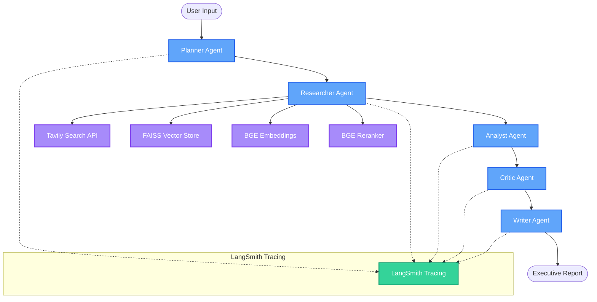

# AI Industry Intelligence Platform — Architecture Design

This document details the production-grade architecture of the **AI Industry Intelligence Platform**, an autonomous, local multi-agent research platform.

## 1. System Agentic Flow & Connections

### 1.1 Architectural Flow Diagram
Below is the architectural schematic showing the vertical multi-agent flow, the Researcher's connections to search and memory components, and the global LangSmith tracing instrumentation:

### 1.2 System Architecture Overview
The platform consists of a three-tier layered architecture that runs entirely on local infrastructure (except for web searches):

---

## 2. Core Components

### 2.1 User Layer (Streamlit Frontend)
- **Topic Input Form**: Captures research queries, custom business context, and configures iteration limits.
- **Visual Swarm Map**: Renders an interactive CSS node map illustrating the active agent execution state.
- **Progress step tracker**: Displays a real-time status timeline of workflow phases (Planning -> Research -> Analysis -> Critique -> Writing).
- **Report Viewer**: Renders the generated executive-level report in structured expanders.
- **Reference & Citation Viewer**: Maps factual assertions in the report back to grounded references with domain credibility metrics.

### 2.2 API Layer (FastAPI Backend)
- **Research Endpoints**: Async endpoints to create, check status, download reports, and track details of sessions.
- **SSE Stream**: A Server-Sent Events endpoint streaming job status changes, iteration counts, and logs in real-time.
- **Model Health Check**: Validates the health and connection status of local Ollama primary and fallback models.

### 2.3 Orchestration Layer (LangGraph Multi-Agent Workflows)
- Coordinates independent, specialized agents using a state-graph topology:
  1. **Planner Agent**: Parses user queries dynamically into multiple task objectives and search queries using Qwen3 (falls back to rule-based templates if needed).
  2. **Researcher Agent**: Generates targeted web search candidates, conducts web scrapes via the Tavily Search API, performs URL normalization and deduplication, and scores relevance using the **BGE Reranker** cross-encoder. Saves chunks to semantic memory.
  3. **Analyst Agent**: Queries the FAISS memory index for historical context and synthesizes raw evidence chunks to extract structured findings, metrics, and trends.
  4. **Critic Agent**: Audits findings against source citations to identify unsupported claims or contradictions. Triggers a self-corrective retry loop if quality scores fall below `0.70`.
  5. **Writer Agent**: Composes polished, executive-level reports with citations.

### 2.4 Infrastructure & Memory Layer
- **Local Inference (Ollama)**: Hosts the primary LLM (`Qwen3-8B-Instruct`) and fallback LLM (`Llama 3.1 8B Instruct`) to guarantee data privacy.
- **Vector memory (FAISS)**: Chunked research documents are embedded using a local `BAAI/bge-base-en-v1.5` sentence-transformer and saved to an IP index.
- **Observability (LangSmith)**: Tracks tracing, latency, token consumption, and agent graph states for debugging.
